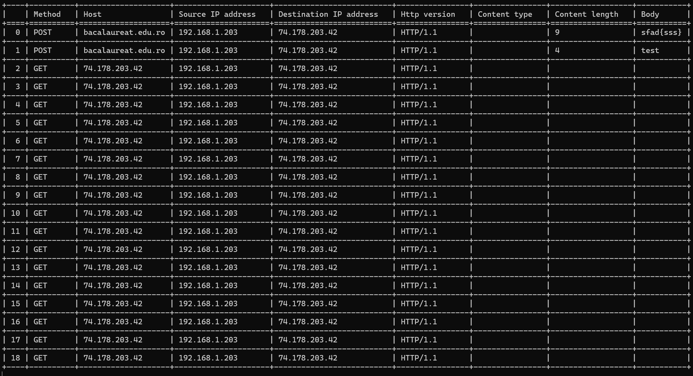

# HTTP-Sniffer
A lightweight command-line network sniffing tool, built with Python for capturing and analyzing HTTP traffic in real-time.

The tool operates by creating a low-level raw socket to capture all network packets directly from the network interface. Based on the catpured packets, it decodes HTTP requests and responses, allowing users to monitor HTTP traffic in real-time.

Note: The tool only captures HTTP traffic, not HTTPS because HTTPS traffic is encrypted.

## Usage
To start sniffing HTTP traffic on your default network interface, run the script with administrator privileges.

`python Sniffer.py`

Then, an interactive console will start, allowing you to start sniffing or set some filters. The exact commands will apppear by using `help` command.

Example:
